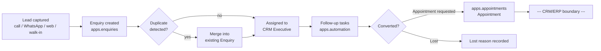
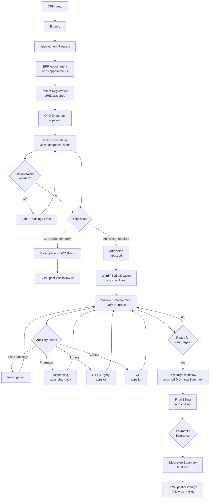
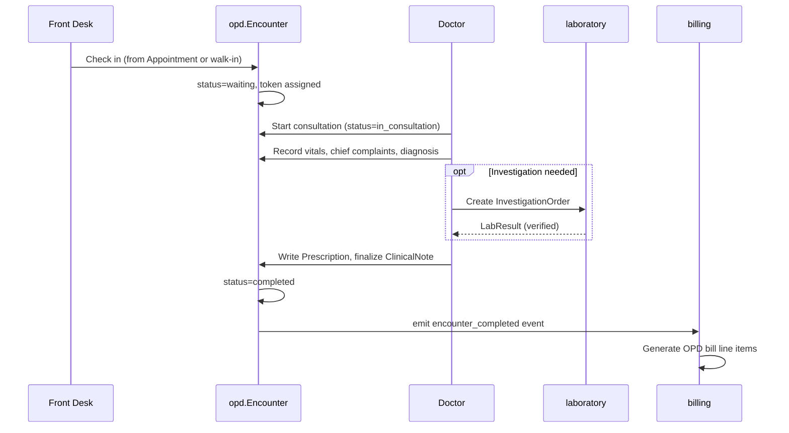
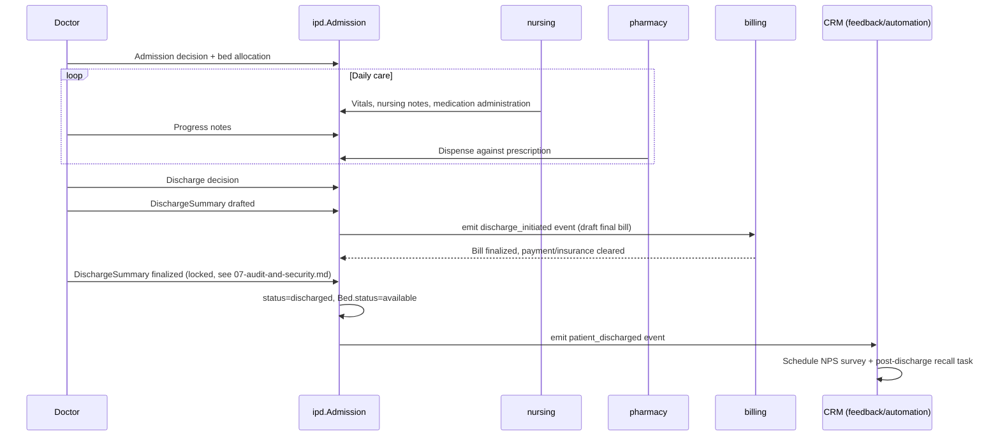

# Workflows

## CRM workflow (existing, shipped)

This is what exists today. `J` is the handoff point this plan's Phase 3 activates — an `Appointment` reaching its scheduled time currently just sits there; Phase 3 makes checking a patient in create an `opd.Encounter`, which is where the ERP lifecycle below begins.

## ERP patient lifecycle (new — the full spec Part 7 flow)

Blue-tinted nodes are CRM-owned; everything else is ERP-owned. The two crossing points (`APPT`→`REG` and `SUMMARY`→`FUP2`) are exactly the two domain events `05-integration-architecture.md` formalizes — every other transition is internal to one domain.

## OPD sub-workflow detail

## IPD/discharge sub-workflow detail

